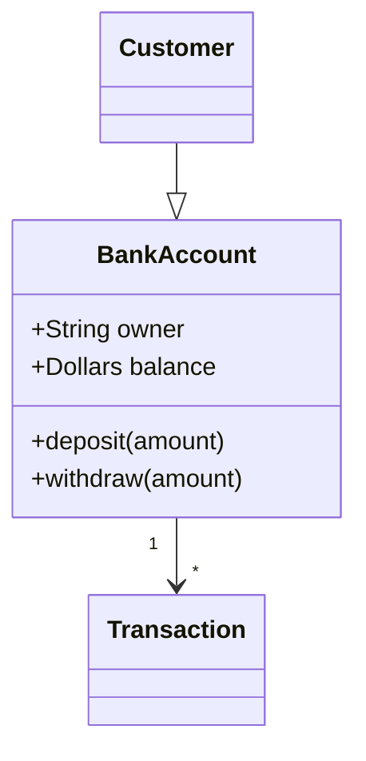
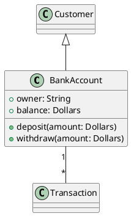

# UML Diagram Query

Query UML class diagrams from the command line. Supports plain text, Mermaid (`classDiagram`), and PlantUML (`@startuml`) formats. Auto-detects format by default.

## Setup

Source the script to make functions available in your shell:

```bash
source {baseDir}/uml.sh
```

Or add to your `.bashrc` / `.zshrc`:

```bash
source {baseDir}/uml.sh
```

## Usage

### List all classes

```bash
uml_classes diagram.mmd        # auto-detect format
uml_classes -f mermaid diagram.mmd
uml_classes -f plantuml diagram.puml
uml_classes -f plain diagram.txt
```

### Show class definition + relationships

```bash
uml_class_detail BankAccount diagram.mmd
uml_class_detail -f plantuml BankAccount diagram.puml
```

### Show enum definition

```bash
uml_enum_detail AccountStatus diagram.mmd
uml_enum_detail -f plantuml AccountStatus diagram.puml
```

## Supported Formats

### Plain text
```
class BankAccount {
  +owner: String
  +balance: Dollars
  +deposit(amount: Dollars)
  +withdraw(amount: Dollars)
}
BankAccount "1" -- "*" Transaction
Customer --|> BankAccount
```

### Mermaid (`classDiagram`)


### PlantUML (`@startuml`)


## Options

| Flag | Description |
|------|-------------|
| `-f`, `--format` | Force format: `plain`, `mermaid`, or `plantuml` |
| `-h`, `--help` | Show help |
